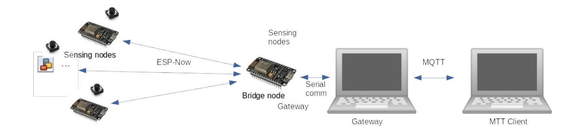

# IoT-group-project


**B31TF IoT Group Assignment**

The challenge for the 2022/23 B31TF IoT Group assignment is to design a small sensor
network based on interconnected **ESP8266** micro-controllers.

The sensor network will notify (over MQTT) whenever someone sits in and/or stands up
from a chair. The software will be used by placing pressure mats (essentially binary switch
sensors) under each chair, and by interfacing each mat with a ESP8266. For the purpose
of this assignment, each pressure mat will be replaced with a simple push button.

Consider that each ESP8266 interfaced with a mat (sensing node) will be powered with a
rechargeable battery. However, one of the ESP8266s (the bridge node) will not be
interfaced with a pressure mat and it will be powered through the USB. Specifically, it will
be connected with a gateway (e.g. a laptop) and communicate with it over the serial port,
see the system diagram in Figure 1, below.

The group should produce code for all the ESP8266s in the wireless sensor network
(sensing and bridge node), and also for the gateway.



```
Figure 1 : System Diagram
```


**Requirements** :

- For energy efficiency, sensing nodes should communicate with the bridge using
    **ESP-Now**. ESP-Now is a network protocol that enables multiple devices to
    communicate with one another without using Wi-Fi.
- The software running on the gateway should use a MQTT client, to enable other
    MQTT clients operating on the same LAN to interact with the sensor network.
- MQTT clients should be able to subscribe and receive notifications, but also to
    control the sensor network, including to enable/disable the whole network (all the
    sensing nodes).
- Events (i.e. pushing or releasing a push button, representing someone standing on /
    off a mat) should be notified through MQTT within an acceptable delay. How much
    delay is acceptable (e.g. 1 seconds, 10 seconds) should be configurable.
- The group should select the battery, e.g. from available catalogues from suppliers
    such as RS, Rapid Electronics or Amazon. Each sensing node should be powered
    by the same type of battery. The bridge node will be the only node powered through
    the USB.
- Each group should demonstrate their system during the lab session on Week 12.
    For the purpose of the assignment, the sensor mats will be replaced with actual
    binary switch sensors. Also, sensing nodes will be powered through the USB, i.e.
    the groups will not need to procure and install batteries.
- The software should be designed to maximise the expected lifetime of the sensor
    network (Hint:Investigate all available sleeping modes for the ESP8266 and for all
    the components of your system).


- The system should be easy to use, install and maintain. In particular, it should be
    easy to add new sensing nodes and to configure the network.
- Open: Students are free to develop any user interface or additional software (e.g.
    dashboards, mobile clients) they’d like to add to the system in order to satisfy the
    requirements above and to present their system during the demonstration on week
    12.


